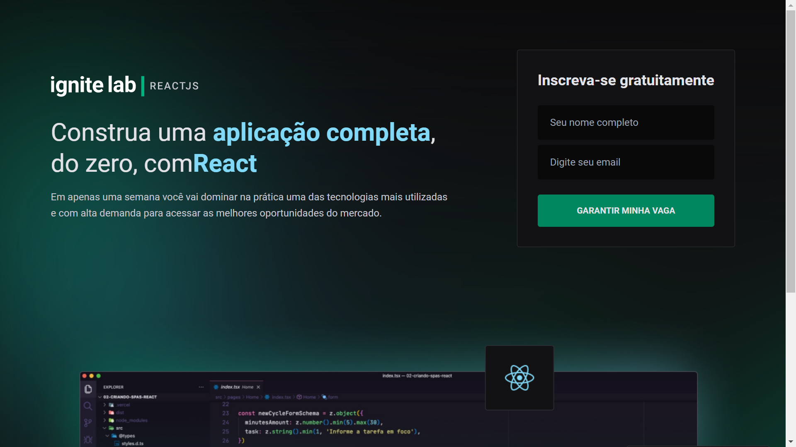
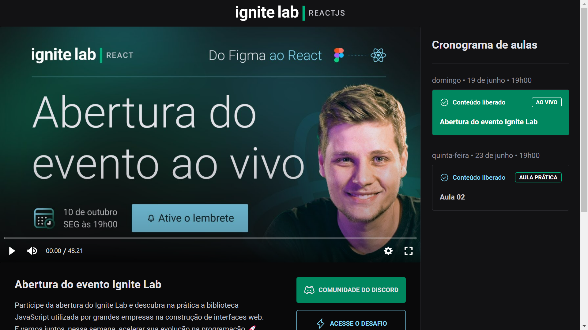

# 🚀 Projeto Ignite Lab - Event Platform

  Este projeto foi criado com o intuido de aprender e descobrir novas tecnologias, este site é uma replica da página do evento do Ignite Lab, onde é composto por duas páginas, uma página de login, e a outra do evento onde é possivél acessar as aulas do evento.
  Este projeto foi devenvolvido com as melhores ferramentas do mercado, utilizando a plataforma [GraphCMS](https://hygraph.com/) para construir uma API e guardar os dados das aulas e outras informações importantes.

## 📷 Layout da Aplicação

  
  

## 🔧 Ferramentas
  
  <ul>
    <li>Vscode</li>
    <li>Vite</li>
    <li>React.js</li>
    <li>Typescript</li>
    <li>Apollo Client</li>
    <li>GraphQL</li>
    <li>Phosphor Icons</li>
    <li>Tailwind CSS</li>
    <li>PostCSS</li>
  </ul>

## 🏷️ Como rodar a Aplicação

  - Clone este repositório `git clone https://github.com/TiagoM13/event-platform.git`
  - Dê o comando `yarn ou npm` para baixar os pacotes.
  - No arquivo `.env.example`, renomei para `.env.local` ou algo especifico e adicione as variavéis de ambiente necessárias, API do graphCMS e o token do seu projeto na plataforma.
